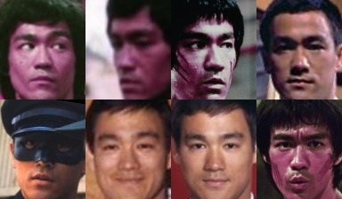
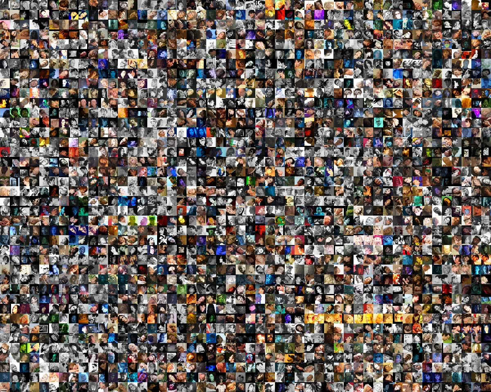

# Face Everthing
face detection alignment recognition reconstruction base on some projects on github, aim to build state of art face system.
currently reconstruction is not available, code is not elegant.

## Reference

#### Project
0. [OpenFace](https://github.com/TadasBaltrusaitis/OpenFace)
0. [openpose](https://github.com/CMU-Perceptual-Computing-Lab/openpose)
0. [mtcnn](https://github.com/wowo200/MTCNN)
0. [SeetaFace](https://github.com/seetaface/SeetaFaceEngine)
0. [FaceAlignment3000](https://github.com/yulequan/face-alignment-in-3000fps)
0. [ExplicitShapeRegression](https://github.com/soundsilence/FaceAlignment.git)
0. [SphereFace](https://github.com/wy1iu/sphereface)
#### Paper
0. [OpenFace: an open source facial behavior analysis toolkit](https://www.google.com.hk/url?sa=t&rct=j&q=&esrc=s&source=web&cd=1&cad=rja&uact=8&ved=0ahUKEwiKo7-06e7WAhWIfbwKHS8rAsEQFggkMAA&url=https%3A%2F%2Fwww.cl.cam.ac.uk%2Fresearch%2Frainbow%2Fprojects%2Fopenface%2Fwacv2016.pdf&usg=AOvVaw1J5nJGO9jeKi5E4YHiMiyx)
0. [Constrained Local Neural Fields for robust facial landmark detection in the wild](https://www.google.com.hk/url?sa=t&rct=j&q=&esrc=s&source=web&cd=1&cad=rja&uact=8&ved=0ahUKEwjrjLXa6e7WAhWKwLwKHdZvCNgQFggkMAA&url=https%3A%2F%2Fwww.cl.cam.ac.uk%2F~tb346%2Fpub%2Fpapers%2Ficcv2013.pdf&usg=AOvVaw3k8eh_J_TxJubPP1ysBPb7)
0. [Realtime Multi-Person 2D Pose Estimation using Part Affinity Fields](https://www.google.com.hk/url?sa=t&rct=j&q=&esrc=s&source=web&cd=2&cad=rja&uact=8&ved=0ahUKEwjKnsKq6O7WAhXFXbwKHZ9iB_YQFggrMAE&url=https%3A%2F%2Farxiv.org%2Fabs%2F1611.08050&usg=AOvVaw2WbHoISe-y-1kPw-YR88Hy) 
0. [Hand Keypoint Detection in Single Images using Multiview Bootstrapping](https://www.google.com.hk/url?sa=t&rct=j&q=&esrc=s&source=web&cd=1&cad=rja&uact=8&ved=0ahUKEwisp-L66O7WAhWMvrwKHbLSBNcQFggnMAA&url=https%3A%2F%2Farxiv.org%2Fabs%2F1704.07809&usg=AOvVaw0VkheeM_5dtwGlU5oqXtua) 
0. [Convolutional pose machines](https://www.google.com.hk/url?sa=t&rct=j&q=&esrc=s&source=web&cd=1&cad=rja&uact=8&ved=0ahUKEwjYosqM6e7WAhXJvLwKHXpECq4QFggnMAA&url=https%3A%2F%2Farxiv.org%2Fabs%2F1602.00134&usg=AOvVaw0UofcH2X5xlsKnZHNM0k8Q) 
0. [Joint Face Detection and Alignment using Multi-task Cascaded Convolutional Neural Networks](https://www.google.com.hk/url?sa=t&rct=j&q=&esrc=s&source=web&cd=2&cad=rja&uact=8&ved=0ahUKEwirurzB6u7WAhXFbrwKHeprCe8QFggrMAE&url=https%3A%2F%2Farxiv.org%2Fabs%2F1604.02878&usg=AOvVaw1yLLG1yg9ngKZqM2oGTAkX)
0. [SphereFace: Deep Hypersphere Embedding for Face Recognition](https://www.google.com.hk/url?sa=t&rct=j&q=&esrc=s&source=web&cd=1&cad=rja&uact=8&ved=0ahUKEwiNu4ex7O7WAhVDO7wKHQ7qCv0QFggkMAA&url=https%3A%2F%2Farxiv.org%2Fabs%2F1704.08063&usg=AOvVaw0vTkb6ot07wiuDegIInbjy)
0. [Large-Margin Softmax Loss for Convolutional Neural Networks](https://www.google.com.hk/url?sa=t&rct=j&q=&esrc=s&source=web&cd=2&ved=0ahUKEwi3ktO67O7WAhWBfrwKHV_vCTQQFgguMAE&url=https%3A%2F%2Farxiv.org%2Fpdf%2F1612.02295&usg=AOvVaw3Xig5JT8V50edhyAvFYgqS)

## Features
#### mtcnn align casia dataset (cpp implement matlab cp2tform)
Success algin 453078 of 455594 images, take about 1.11hour, hope someone can increase detection rate and reduce run time.

- Aligned example

</img>

- Failed example

</img>

#### put all in one, mtcnn detection, openpose alignment, cln tracking and sphereface recognition

</img>

## Installation
#### Requirements
- OpenCV (>=3.0)
- Boost (>=1.63)
- [SphereCaffe](https://github.com/wy1iu/sphereface/tree/master/tools/caffe-sphereface)
- CUDA (>=8.0)
#### Complie
- Install all requirements
- git clone https://github.com/tpys/face-everthing.git
- change line 44 & 45 in CMakeList.txt to your spherecaffe corresponding directory
- cd face-everthing && mkdir build && cd build && make -j4
#### Run Example
- Download trained model(https://pan.baidu.com/s/1boOOBNL code: juk3)
- Modify example/mtcnn_align_dataset.cpp, change the input parameters to yours
- Modify example/all_in_one.cpp, change the input parameters to yours
## TODO:
- [ ] move cln part to tracking modules
- [ ] add recently fan 2d & 3d alignment
- [ ] speed up alignment, maybe batch gpu forward, small model, gpu implementation tracking.
- [ ] train more accurate recognition model

## Call for contributions
- Anything helps this repo, including **discussion**, **testing**, **promotion** and of course **your awesome code**.
